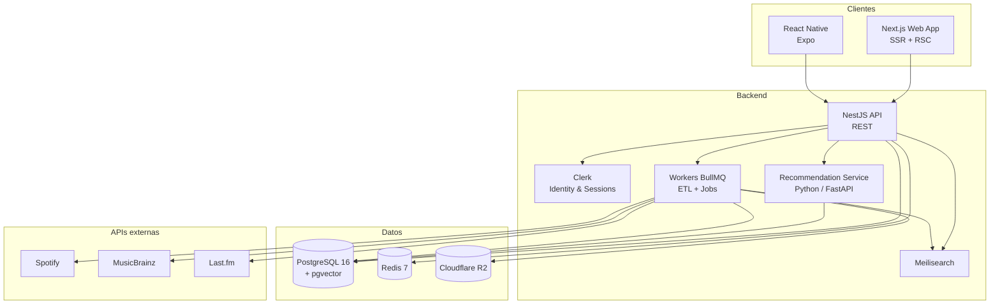

<div align="center">

# 🎵 Coda

**El diario musical donde registrás lo que escuchás, descubrís álbumes que se te habrían escapado y encontrás gente con tu mismo oído.**

_Red social de descubrimiento musical inspirada en Letterboxd._

[](#-roadmap)
[](#-licencia)
[](#-contribuir)
[](#-stack-tecnológico)

</div>

---

## 📖 Tabla de contenidos

- [¿Qué es Coda?](#-qué-es-coda)
- [Características](#-características)
- [Arquitectura](#-arquitectura)
- [Stack tecnológico](#-stack-tecnológico)
- [Estructura del monorepo](#-estructura-del-monorepo)
- [Puesta en marcha](#-puesta-en-marcha)
- [Variables de entorno](#-variables-de-entorno)
- [Sistema de recomendaciones](#-sistema-de-recomendaciones)
- [Roadmap](#-roadmap)
- [Contribuir](#-contribuir)
- [Créditos de datos y licencias](#-créditos-de-datos-y-licencias)
- [Licencia](#-licencia)

---

## 🎧 ¿Qué es Coda?

**Coda** es donde la gente con buen oído lleva el registro de lo que escucha, califica y reseña álbumes, arma listas con vida propia y recibe recomendaciones **explicables** impulsadas por IA y filtrado colaborativo.

Pensá en **Letterboxd, pero para música**: no es un reproductor, es un lugar para llevar tu diario sonoro, opinar y descubrir.

### Lo que **SÍ** es Coda

- 📓 Un **diario musical** con tracking de escuchas, ratings (1–10) y reseñas.
- 🧭 Un **motor de descubrimiento** personalizado (IA + filtrado colaborativo) con recomendaciones que te explican *por qué*.
- 👥 Una **comunidad** donde el gusto musical es la moneda social: seguís gente, ves su actividad, compartís listas.

### Lo que **NO** es Coda

- 🚫 No es un reproductor de música (no transmite audio).
- 🚫 No es un agregador de reseñas profesionales (Pitchfork, AOTY ya existen).
- 🚫 No es una red social generalista.

### ¿Para quién?

- **Primario:** melómanos de 18–40 que ya usan Spotify/Apple Music y quieren registrar lo que escuchan y encontrar gente con gustos afines.
- **Secundario:** crate diggers, coleccionistas de vinilo, críticos amateur, productores y curadores de playlists.

---

## ✨ Características

| | Funcionalidad | Descripción |
|---|---|---|
| 🔎 | **Catálogo unificado** | MusicBrainz como fuente canónica + Spotify para metadata moderna + Last.fm para estadísticas históricas. |
| ✅ | **Tracking de escuchas** | Registrá álbumes escuchados con fecha, nota y fuente (manual o sync). |
| ⭐ | **Ratings y reseñas** | Puntuá del 1 al 10 y escribí reseñas con soporte de spoilers y likes. |
| 📝 | **Listas** | Rankeables, públicas o privadas, colaborativas y viralizables. |
| 🤖 | **Recomendaciones explicables** | Híbridas (content-based + colaborativo + popularidad), con el "por qué" siempre visible. |
| 👤 | **Perfiles** | 4 álbumes favoritos, historial reciente, estadísticas de género y década. |
| 🌐 | **Feed social** | Seguí usuarios y mirá su actividad; feed global para descubrimiento. |
| 🔥 | **Gamificación** | Rachas diarias, insignias y retos semanales rotativos. |
| 📊 | **Tu año en Coda** | Resumen anual estilo "Wrapped" propio. |
| 📱 | **Web + Mobile** | Web responsive (Next.js) y app nativa (React Native / Expo). |

---

## 🏗️ Arquitectura

Monolito modular (NestJS) + un único servicio aparte para recomendaciones (Python), con workers para ETL y jobs.



### Decisiones clave

- **Monolito modular** para velocidad de desarrollo; solo el motor de recomendaciones se separa (es Python).
- **Prisma** para type-safety end-to-end y migraciones declarativas.
- **Meilisearch** para búsqueda tolerante a typos (Postgres FTS no escala para eso).
- **pgvector** para almacenar embeddings de álbumes y usuarios en la misma DB (búsqueda ANN sin sumar Pinecone).
- **Clerk** para auth con OAuth (Spotify/Google/Apple) listo, con posible migración a Auth.js si crece el costo.

---

## 🧰 Stack tecnológico

**Frontend (Web)**
`Next.js 14 (App Router, RSC)` · `React 18` · `TypeScript 5` · `Tailwind CSS + shadcn/ui` · `TanStack Query` · `Zustand` · `react-hook-form + zod` · `Framer Motion`

**Mobile**
`React Native 0.74` · `Expo SDK 50` · `expo-router` · `React Query` · `nativewind` · `Reanimated`

**Backend**
`NestJS 10` · `TypeScript 5` · `Prisma 5` · `BullMQ` · `Zod` · `Pino` · `@clerk/backend` · `Swagger (OpenAPI)`

**Servicio de recomendaciones**
`Python 3.11` · `FastAPI` · `implicit (ALS)` · `scikit-learn` · `pandas / polars` · `sentence-transformers` · `pgvector`

**Infraestructura**
`Vercel (web)` · `Railway / Fly.io (API + reco)` · `Supabase / Neon (Postgres + pgvector)` · `Upstash (Redis)` · `Cloudflare R2 + CDN` · `Resend (email)` · `Sentry + Axiom + PostHog` · `GitHub Actions`

---

## 📂 Estructura del monorepo

```
coda/
├── apps/
│   ├── web/              # Next.js (web)
│   ├── mobile/           # Expo (iOS + Android)
│   ├── api/              # NestJS (API + workers)
│   └── reco/             # FastAPI (recomendaciones)
├── packages/
│   ├── db/               # Prisma schema + cliente compartido
│   ├── ui/               # shadcn/ui + componentes propios
│   ├── types/            # Tipos y schemas zod compartidos
│   ├── config/           # ESLint, TSConfig, Tailwind preset
│   └── analytics/        # Wrapper de PostHog
├── infra/
│   ├── docker/           # docker-compose (Postgres, Redis, Meilisearch)
│   └── github-actions/
├── turbo.json
├── pnpm-workspace.yaml
└── README.md
```

---

## 🚀 Puesta en marcha

> ⚠️ El proyecto está en desarrollo temprano. Estos pasos reflejan el flujo objetivo del monorepo.

### Requisitos previos

- **Node.js** ≥ 20 (recomendado 24)
- **pnpm** (`corepack enable pnpm`)
- **Docker** (Postgres + pgvector, Redis y Meilisearch locales)
- Cuentas de developer: **Clerk**, **Spotify**, **Last.fm**

### Instalación

```bash
# 1. Clonar e instalar dependencias
git clone https://github.com/<tu-usuario>/coda.git
cd coda
pnpm install

# 2. Configurar variables de entorno
cp .env.example .env   # completar con tus claves

# 3. Levantar servicios locales (Postgres, Redis, Meilisearch)
docker compose -f infra/docker/docker-compose.yml up -d

# 4. Migrar y sembrar la base de datos
pnpm db:migrate
pnpm db:seed:genres      # ~150 géneros curados
pnpm db:seed:albums      # top de álbumes vía Spotify

# 5. Arrancar en modo desarrollo
pnpm dev                 # web + api (Turborepo)
```

### Scripts útiles

```bash
pnpm dev                 # Todos los apps en watch mode
pnpm build               # Build de todo el monorepo
pnpm lint                # Lint + typecheck
pnpm db:migrate          # Aplicar migraciones Prisma
pnpm db:seed:genres      # Cargar géneros
pnpm db:seed:test-users  # 20 usuarios de prueba con historial
pnpm reco:retrain        # Reentrenar modelo de recomendaciones
```

---

## 🔐 Variables de entorno

```bash
# App
NODE_ENV=development
APP_URL=http://localhost:3000
API_URL=http://localhost:4000

# Base de datos
DATABASE_URL=postgresql://...
DIRECT_URL=postgresql://...          # para migraciones Prisma

# Redis
REDIS_URL=redis://localhost:6379

# Auth (Clerk)
CLERK_PUBLISHABLE_KEY=pk_...
CLERK_SECRET_KEY=sk_...
CLERK_WEBHOOK_SECRET=whsec_...

# APIs externas
SPOTIFY_CLIENT_ID=...
SPOTIFY_CLIENT_SECRET=...
LASTFM_API_KEY=...
MUSICBRAINZ_USER_AGENT="Coda/1.0 ( contact@coda.app )"

# Búsqueda
MEILI_HOST=http://localhost:7700
MEILI_MASTER_KEY=...

# Storage (Cloudflare R2)
R2_ACCOUNT_ID=...
R2_ACCESS_KEY_ID=...
R2_SECRET_ACCESS_KEY=...
R2_BUCKET=coda-assets

# Servicio de recomendaciones
RECO_SERVICE_URL=http://localhost:8000
RECO_API_KEY=...

# Observabilidad
SENTRY_DSN=...
POSTHOG_KEY=...
AXIOM_TOKEN=...
```

> El archivo `.env.example` versionado documenta todas las claves sin valores reales.

---

## 🤖 Sistema de recomendaciones

Enfoque **híbrido en 3 capas**, combinadas por un ranker final que se adapta al estado del usuario (cold → warm → hot):

1. **Content-based** — similitud coseno entre el vector del usuario (centroide ponderado de lo escuchado) y el vector del álbum (géneros, artista, año, país y embedding textual).
2. **Filtrado colaborativo** — ALS implícito sobre la matriz `usuarios × álbumes`, reentrenado en batch nocturno.
3. **Popularidad / frescura** — trending por género con decay temporal, usado como prior en cold-start y booster de exploración.

Cada recomendación se persiste con un `reason_json` que alimenta la frase **"por qué te lo recomendamos"** — nada de cajas negras:

> _"Porque te gustó Kid A y este suena parecido."_
> _"3 usuarios con tu mismo gusto lo pusieron en su top."_

---

## 🗺️ Roadmap

| Fase | Objetivo | Estado |
|---|---|---|
| **F0** | Setup, diseño y CI/CD | ⏳ En curso |
| **F1** | **MVP**: auth, onboarding, catálogo, tracking, perfil, reco v1 (content-based) | 🔜 |
| **F2** | Social y listas: follows, feed, reseñas con likes | 🔜 |
| **F3** | Reco v2: servicio Python, ALS, pgvector, explicabilidad | 🔜 |
| **F4** | Gamificación: rachas, insignias, retos, "Tu año en Coda" | 🔜 |
| **F5** | Mobile nativo (Expo) + sync con Spotify/Apple Music | 🔜 |
| **F6** | Crecimiento: sugerencia de usuarios, curaduría editorial, integraciones | 🔜 |

**Métrica norte estrella:** álbumes registrados por usuario activo semanal (objetivo: 4+ a los 6 meses).

---

## 🤝 Contribuir

Coda todavía está en fase temprana. Si querés sumarte:

1. Hacé un fork y creá una rama descriptiva (`feat/album-page`, `fix/onboarding-genres`).
2. Seguí las convenciones de commits (Conventional Commits).
3. Corré `pnpm lint` y `pnpm test` antes de abrir el PR.
4. Abrí un PR describiendo el *qué* y el *por qué* del cambio.

---

## 📜 Créditos de datos y licencias

Coda se apoya en fuentes de datos abiertas y APIs de terceros. **No** se almacena ni transmite audio.

- **MusicBrainz** — datos bajo CC0. _Powered by [MusicBrainz](https://musicbrainz.org/)._
- **Spotify Web API** — metadata cacheada según sus ToS. _Powered by Spotify._
- **Last.fm API** — estadísticas históricas, con atribución.
- **Cover Art Archive** — carátulas cacheadas en R2 (licencias variables, generalmente CC).

---

## ⚖️ Licencia

Licencia **por definir**. Hasta que se especifique un archivo `LICENSE`, todos los derechos quedan reservados por los autores del proyecto.

---

<div align="center">

_Coda — porque lo que escuchás también cuenta una historia._ 🎶

</div>
