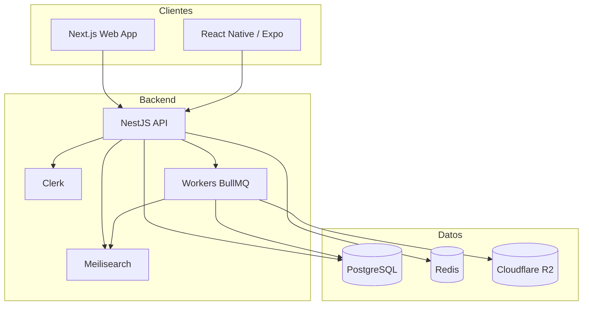

<div align="center">

# 🎵 Coda

**El diario musical donde registrás lo que escuchás, descubrís álbumes que se te habrían escapado y encontrás gente con tu mismo oído.**

_Red social de descubrimiento musical inspirada en Letterboxd._

[](#-roadmap)
[](#-licencia)
[](#-stack-tecnológico)

</div>

---

## 📖 Tabla de contenidos

- [¿Qué es Coda?](#-qué-es-coda)
- [Características](#-características)
- [Arquitectura](#-arquitectura)
- [Stack tecnológico](#-stack-tecnológico)
- [Estructura del monorepo](#-estructura-del-monorepo)
- [Puesta en marcha](#-puesta-en-marcha)
- [Roadmap](#-roadmap)
- [Contribuir](#-contribuir)
- [Licencia](#-licencia)

---

## 🎧 ¿Qué es Coda?

**Coda** es Letterboxd, pero para música: no es un reproductor, es un lugar para llevar tu diario sonoro, calificar y reseñar álbumes, armar listas y recibir recomendaciones **explicables**.

No es un reproductor de audio, ni un agregador de reseñas profesionales, ni una red social generalista — el gusto musical es la moneda social acá.

> El detalle completo de producto (personas, casos de uso, requisitos por fase) vive en [`coda_especificacion_tecnica.md`](./docs/coda_especificacion_tecnica.md). Este README es la puerta de entrada rápida al repo, no un reemplazo de ese documento.

---

## ✨ Características

| | Funcionalidad |
|---|---|
| 🔎 | Catálogo unificado (MusicBrainz + Spotify) |
| ✅ | Tracking de escuchas, ratings (1–10) y reseñas |
| 📝 | Listas rankeables, públicas o privadas |
| 🤖 | Recomendaciones explicables (content-based + colaborativo) |
| 👤 | Perfiles con favoritos, historial y estadísticas |
| 🌐 | Feed social: seguís gente y ves su actividad |
| 📱 | Web (Next.js) + mobile nativo (Expo) a futuro |

---

## 🏗️ Arquitectura

Monolito modular (NestJS) + un servicio aparte en Python para recomendaciones, con workers para ETL e imports de catálogo.



**Por qué así**: monolito modular para velocidad de desarrollo (equipo chico); Prisma para type-safety end-to-end; Meilisearch porque Postgres FTS no tolera bien los typos; Clerk para auth con OAuth social ya resuelto.

---

## 🧰 Stack tecnológico

- **Web**: Next.js 16 (App Router) · React 19 · TypeScript · Tailwind
- **API**: NestJS 11 · Prisma 7 · BullMQ · Clerk
- **Datos**: PostgreSQL · Redis · Meilisearch · Cloudflare R2
- **Mobile** (a futuro): React Native / Expo
- **Reco v2** (a futuro): Python / FastAPI

---

## 📂 Estructura del monorepo

```
coda/
├── apps/
│   ├── web/              # Next.js
│   └── api/              # NestJS (API + workers)
├── packages/
│   ├── db/                # Prisma schema + cliente compartido
│   ├── ui/                 # Componentes compartidos
│   ├── types/              # Tipos y schemas compartidos
│   └── config/             # ESLint, TSConfig, Tailwind preset
├── docker-compose.yml       # Postgres, Redis, Meilisearch locales
└── turbo.json
```

---

## 🚀 Puesta en marcha

```bash
git clone https://github.com/ramatc/coda.git && cd coda
pnpm install

cp .env.example .env          # completar con tus claves — ver ese archivo para la lista completa

docker compose up -d          # Postgres, Redis, Meilisearch
pnpm --filter @coda/db db:migrate

pnpm dev                      # web + api en watch mode
```

Scripts útiles: `pnpm build` · `pnpm lint` · `pnpm typecheck` · `pnpm test`.

---

## 🗺️ Roadmap

| Fase | Objetivo | Estado |
|---|---|---|
| **F0** | Setup, diseño y CI/CD | ✅ Hecho |
| **F1** | MVP: auth, onboarding, catálogo, tracking, perfil, reco v1 | 🚧 En curso |
| **F2** | Social y listas: follows, feed, reseñas con likes | 🔜 |
| **F3** | Reco v2: servicio Python, embeddings, explicabilidad | 🔜 |
| **F4** | Gamificación: rachas, insignias, "Tu año en Coda" | 🔜 |
| **F5** | Mobile nativo (Expo) | 🔜 |

Detalle de alcance por fase en [`coda_especificacion_tecnica.md`](./docs/coda_especificacion_tecnica.md).

---

## 🤝 Contribuir

1. Rama descriptiva (`feat/album-page`, `fix/onboarding-genres`).
2. Conventional Commits.
3. `pnpm lint && pnpm test` antes de abrir el PR.

---

## ⚖️ Licencia

Por definir. Hasta que exista un archivo `LICENSE`, todos los derechos quedan reservados por los autores del proyecto.

---

<div align="center">

_Coda — porque lo que escuchás también cuenta una historia._ 🎶

</div>
