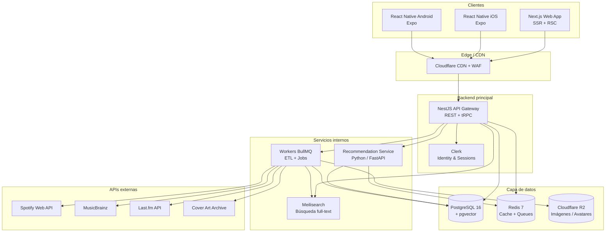
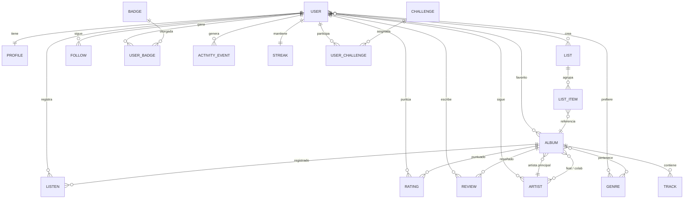
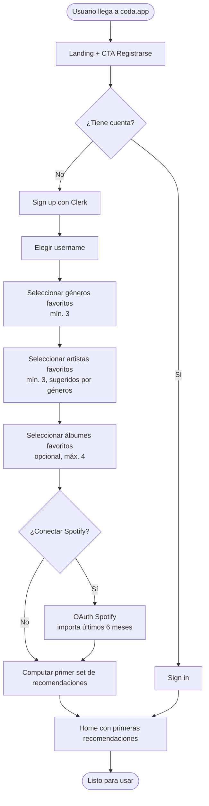
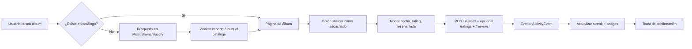
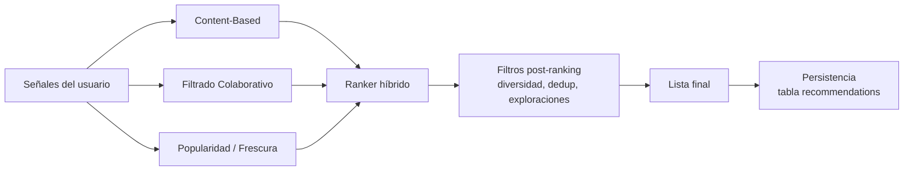
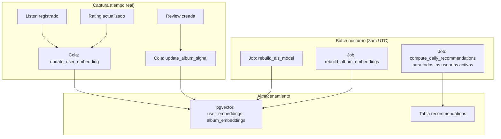

# Coda — Especificación Técnica del Producto

> Red social de descubrimiento musical inspirada en Letterboxd.
> Documento maestro de producto, arquitectura, datos, API, recomendaciones y roadmap.
> **Versión:** 1.0 · **Idioma:** ES

---

## Tabla de contenidos

1. [Selección del nombre](#1-selección-del-nombre)
2. [Visión y posicionamiento](#2-visión-y-posicionamiento)
3. [Arquitectura técnica](#3-arquitectura-técnica)
4. [Stack tecnológico](#4-stack-tecnológico)
5. [Modelo de datos y base de datos](#5-modelo-de-datos-y-base-de-datos)
6. [Schema Prisma](#6-schema-prisma-modelo-de-entidades)
7. [API REST — Endpoints](#7-api-rest--endpoints)
8. [Flujos de usuario](#8-flujos-de-usuario)
9. [Wireframes](#9-wireframes)
10. [Sistema de recomendaciones](#10-sistema-de-recomendaciones)
11. [Gamificación](#11-gamificación)
12. [Roadmap por fases](#12-roadmap-por-fases)
13. [KPIs y métricas de éxito](#13-kpis-y-métricas-de-éxito)
14. [Consideraciones legales y de licencias](#14-consideraciones-legales-y-de-licencias)
15. [Apéndices](#15-apéndices)

---

## 1. Selección del nombre

### Recomendación principal: **Coda**

**Por qué Coda gana sobre las demás opciones:**

| Nombre | Pros | Contras | Veredicto |
|---|---|---|---|
| **Coda** | Término musical reconocible (cierre de una pieza), 4 letras, fonéticamente fuerte, brandable, .com posiblemente disponible con sufijo (codaapp, codafm) | Hay una herramienta de docs llamada Coda.io (posible roce SEO, no de marca) | ★★★★★ |
| Side B | Concepto perfecto (B-sides = joyas ocultas), evoca cultura vinilo | Dos palabras, dificultad SEO, complica URL | ★★★★ |
| Crate | "Crate digging" es cultura de descubrimiento musical pura | Connotación de "caja" para no melómanos | ★★★★ |
| Deep Cut | Significa "tema profundo / no comercial" | Demasiado largo, no es brandable como verbo | ★★★ |
| Tempo / Sonar / Echo | Genéricos | Ya usados por otros productos tech | ★★ |

**Acción sugerida:** registrar simultáneamente `getcoda.fm`, `coda.app` o `listentocoda.com`, y handles `@codaapp` en redes. Como plan B, mantener Crate y Side B en reserva.

> En el resto del documento se usa **Coda** como nombre del proyecto.

---

## 2. Visión y posicionamiento

### Pitch en una frase

> Coda es donde la gente con buen oído lleva el diario de lo que escucha, descubre álbumes que de otro modo se le hubieran escapado, y encuentra a otros con su mismo gusto.

### Mapa competitivo

```
                    Pasivo / consumo                    Activo / curación
                          ▲                                    ▲
                          │                                    │
   Spotify, Apple Music ──┘                                    └── Letterboxd, Goodreads
                          │                                    │
   Last.fm ───────────────┤                                    ├── RateYourMusic, AOTY
                          │           CODA  ◄───────────────── │
                          │     (descubrimiento + tracking +   │
                          │      social + recomendación IA)    │
                          ▼                                    ▼
                    Datos / históricos                    Comunidad / opinión
```

**Lo que NO es Coda:**

- No es un reproductor de música (no transmite audio).
- No es un agregador de reseñas profesionales (Pitchfork, AOTY ya existen).
- No es una red social generalista.

**Lo que SÍ es Coda:**

- Un **diario musical** con tracking, ratings y reseñas.
- Un **motor de descubrimiento** personalizado vía IA + filtrado colaborativo.
- Una **comunidad** donde el gusto musical es la moneda social.

### Usuario objetivo

- **Primario:** melómanos de 18-40 años que ya usan Spotify/Apple Music y quieren llevar registro de lo que escuchan y encontrar gente con gustos similares.
- **Secundario:** crate diggers, coleccionistas de vinilo, críticos amateur, productores y curadores de playlists.

### Propuestas de valor diferenciales (vs. competencia)

1. **Recomendaciones híbridas explicables.** No solo "esto te puede gustar", sino *"esto te puede gustar porque te encantó X y a usuarios con tu mismo gusto les voló la cabeza"*.
2. **Catálogo unificado.** MusicBrainz como fuente canónica + Spotify para metadata moderna + Last.fm para estadísticas históricas.
3. **Listas con vida propia.** Como las de Letterboxd: rankeables, colaborativas, viralizables.
4. **Diario, no algoritmo.** El usuario es dueño de su historial; no se le impone qué escuchar.

---

## 3. Arquitectura técnica

### Diagrama de alto nivel



### Decisiones clave de arquitectura

| Decisión | Elección | Justificación |
|---|---|---|
| Monolito vs. microservicios | **Monolito modular** (NestJS) + 1 servicio aparte (reco) | Velocidad de desarrollo; el equipo es pequeño. Solo separamos el motor de recomendaciones porque es Python. |
| ORM | **Prisma** | Type-safety end-to-end con TypeScript; migraciones declarativas. |
| Búsqueda | **Meilisearch** | Postgres FTS no escala para búsquedas tipográficas tolerantes; Algolia es muy caro. |
| Cache | **Redis** | Sesiones, recomendaciones precomputadas, rate limiting, colas. |
| Mobile | **React Native (Expo)** | Reuso del 70% del código con web (lógica + tipos), un solo equipo. |
| Auth | **Clerk** para MVP, migrar a Auth.js si crece el costo | Time-to-market: OAuth con Spotify/Apple/Google listo. |
| Vectores | **pgvector** | Almacenar embeddings de álbumes y usuarios en la misma DB; búsqueda ANN sin agregar Pinecone. |

### Comunicación entre servicios

- **Cliente ↔ API:** REST sobre HTTPS, JSON. Auth vía JWT de Clerk.
- **API ↔ Reco:** HTTP interno con autenticación por API key. Endpoints sincrónicos para "dame las recomendaciones de X", asincrónicos vía colas para reentrenamiento.
- **API ↔ Workers:** BullMQ sobre Redis para jobs (importar álbum desde Spotify, computar recomendaciones diarias, actualizar feed, etc).
- **Workers ↔ APIs externas:** rate-limited con backoff exponencial, circuit breaker, y cache agresivo (24h-7d según endpoint).

---

## 4. Stack tecnológico

### Frontend (Web)

```
Next.js 14 (App Router, RSC)
├── React 18
├── TypeScript 5
├── Tailwind CSS 3 + shadcn/ui
├── TanStack Query (cache de servidor)
├── Zustand (estado cliente local)
├── react-hook-form + zod (formularios)
├── Framer Motion (animaciones)
├── next-themes (dark/light)
└── Vercel Analytics
```

### Mobile

```
React Native 0.74 con Expo SDK 50
├── expo-router (file-based routing)
├── React Query
├── nativewind (Tailwind en RN)
├── react-native-reanimated
└── Sentry para crash reporting
```

### Backend

```
NestJS 10
├── TypeScript 5
├── Prisma 5 (ORM)
├── BullMQ (colas)
├── Zod (validación de DTOs)
├── Pino (logging estructurado)
├── @clerk/backend (verificación de JWT)
├── @nestjs/throttler (rate limiting)
└── @nestjs/swagger (OpenAPI)
```

### Servicio de recomendaciones

```
Python 3.11 + FastAPI
├── implicit (ALS para filtrado colaborativo)
├── scikit-learn
├── pandas + polars
├── sentence-transformers (embeddings textuales)
├── faiss-cpu (búsqueda ANN local; pgvector en prod)
└── celery o RQ (opcional, para batch jobs)
```

### Infraestructura

| Componente | Servicio |
|---|---|
| Hosting frontend | Vercel (Next.js) |
| Hosting backend | Railway o Fly.io (NestJS + Python) |
| PostgreSQL | Supabase o Neon (con pgvector habilitado) |
| Redis | Upstash |
| Object storage | Cloudflare R2 |
| CDN / DNS | Cloudflare |
| Email transaccional | Resend |
| Push notifications | Expo Push + FCM/APNs |
| Observabilidad | Sentry (errores) + Axiom (logs) + Posthog (analytics + feature flags) |
| CI/CD | GitHub Actions |

---

## 5. Modelo de datos y base de datos

### Diagrama entidad-relación (resumido)



### Tablas principales (resumen)

| Tabla | Propósito | Claves importantes |
|---|---|---|
| `users` | Usuario base, vinculado a Clerk vía `clerk_user_id` | `id` (uuid pk), `clerk_user_id` (unique), `email`, `created_at` |
| `profiles` | Datos públicos del usuario | `user_id` (pk + fk), `username` (unique), `display_name`, `bio`, `avatar_url` |
| `genres` | Catálogo de géneros (semilla curada) | `id`, `slug` (unique), `name`, `parent_genre_id` (jerarquía) |
| `artists` | Catálogo de artistas | `id`, `mbid` (uuid de MusicBrainz, unique), `spotify_id`, `name`, `image_url` |
| `albums` | Catálogo de álbumes | `id`, `mbid`, `spotify_id`, `title`, `release_date`, `cover_url`, `primary_artist_id` |
| `tracks` | Canciones de cada álbum | `id`, `album_id`, `position`, `title`, `duration_ms` |
| `album_artists` | Relación M:N álbum-artista (feats, colaboraciones) | `album_id`, `artist_id`, `role` |
| `album_genres` | Relación M:N álbum-género | `album_id`, `genre_id`, `weight` |
| `user_genre_preferences` | Géneros favoritos del usuario | `user_id`, `genre_id`, `weight` (1-5) |
| `user_artist_favorites` | Artistas favoritos | `user_id`, `artist_id`, `added_at` |
| `user_album_favorites` | Álbumes favoritos (los "4 favoritos" de Letterboxd) | `user_id`, `album_id`, `position` |
| `listens` | Registro de escucha (puede haber varios por álbum) | `id`, `user_id`, `album_id`, `listened_at`, `source` (manual, spotify_sync, lastfm_sync) |
| `ratings` | Puntuación 1-10 | `user_id`, `album_id` (pk compuesta), `score`, `updated_at` |
| `reviews` | Reseña textual | `id`, `user_id`, `album_id`, `body`, `rating_id`, `is_spoiler`, `created_at` |
| `lists` | Listas creadas por el usuario | `id`, `user_id`, `title`, `description`, `is_ranked`, `is_public` |
| `list_items` | Álbumes dentro de listas | `list_id`, `album_id`, `position`, `note` |
| `follows` | Grafo social | `follower_id`, `following_id`, `created_at` |
| `activity_events` | Stream de actividad para feeds | `id`, `user_id`, `type` (LISTEN/RATING/REVIEW/LIST_CREATED/FOLLOW), `target_type`, `target_id`, `created_at` |
| `recommendations` | Recomendaciones precomputadas | `id`, `user_id`, `album_id`, `kind` (DAILY/WEEKLY/DISCOVERY), `score`, `reason_json`, `generated_at` |
| `badges` | Catálogo de insignias | `id`, `slug`, `name`, `description`, `icon_url`, `criteria_json` |
| `user_badges` | Insignias otorgadas | `user_id`, `badge_id`, `awarded_at` |
| `challenges` | Catálogo de retos | `id`, `slug`, `title`, `description`, `start_at`, `end_at`, `criteria_json` |
| `user_challenges` | Progreso del usuario | `user_id`, `challenge_id`, `progress_json`, `completed_at` |
| `streaks` | Racha de escucha diaria | `user_id` (pk), `current_days`, `longest_days`, `last_logged_date` |
| `external_id_map` | Mapeo a IDs externos | `entity_type`, `entity_id`, `provider`, `external_id` |
| `user_embeddings` | Vector de gusto del usuario | `user_id`, `embedding` (vector(128)) |
| `album_embeddings` | Vector del álbum | `album_id`, `embedding` (vector(128)) |

### Índices y consideraciones de performance

```sql
-- Búsquedas frecuentes
CREATE INDEX idx_listens_user_listened_at ON listens(user_id, listened_at DESC);
CREATE INDEX idx_ratings_album_score ON ratings(album_id, score DESC);
CREATE INDEX idx_reviews_album_created ON reviews(album_id, created_at DESC);
CREATE INDEX idx_activity_user_created ON activity_events(user_id, created_at DESC);
CREATE INDEX idx_recommendations_user_kind ON recommendations(user_id, kind, generated_at DESC);

-- Búsqueda vectorial (pgvector con ivfflat o hnsw)
CREATE INDEX idx_album_embeddings_hnsw
  ON album_embeddings USING hnsw (embedding vector_cosine_ops);

-- Búsqueda full-text (fallback a Postgres si Meilisearch cae)
CREATE INDEX idx_albums_search
  ON albums USING gin(to_tsvector('simple', title || ' ' || coalesce(artist_name, '')));

-- Único: una sola rating por usuario-álbum
ALTER TABLE ratings ADD CONSTRAINT uniq_user_album_rating UNIQUE (user_id, album_id);
```

### Particionado y volumen estimado

| Tabla | Volumen año 1 | Volumen año 3 | Estrategia |
|---|---|---|---|
| `listens` | ~10M filas | ~500M filas | Partitioning por mes con `pg_partman` desde día 0 |
| `activity_events` | ~20M filas | ~1B filas | Particionado por mes + retención de 90 días con archivado a R2 |
| `recommendations` | ~50M filas | ~5B filas | TTL automático: borrar > 14 días |
| Resto | < 10M | < 100M | Sin particionado |

---

## 6. Schema Prisma (modelo de entidades)

> Fragmento representativo. El schema completo de producción tendría ~600 líneas.

```prisma
generator client {
  provider        = "prisma-client-js"
  previewFeatures = ["postgresqlExtensions", "fullTextSearch"]
}

datasource db {
  provider   = "postgresql"
  url        = env("DATABASE_URL")
  extensions = [pgvector(map: "vector")]
}

model User {
  id            String   @id @default(uuid()) @db.Uuid
  clerkUserId   String   @unique @map("clerk_user_id")
  email         String   @unique
  createdAt     DateTime @default(now()) @map("created_at")
  updatedAt     DateTime @updatedAt @map("updated_at")

  profile           Profile?
  listens           Listen[]
  ratings           Rating[]
  reviews           Review[]
  lists             List[]
  genrePreferences  UserGenrePreference[]
  artistFavorites   UserArtistFavorite[]
  albumFavorites    UserAlbumFavorite[]
  following         Follow[]               @relation("Follower")
  followers         Follow[]               @relation("Following")
  activityEvents    ActivityEvent[]
  recommendations   Recommendation[]
  badges            UserBadge[]
  challenges        UserChallenge[]
  streak            Streak?
  embedding         UserEmbedding?

  @@map("users")
}

model Profile {
  userId       String  @id @map("user_id") @db.Uuid
  username     String  @unique
  displayName  String  @map("display_name")
  bio          String? @db.Text
  avatarUrl    String? @map("avatar_url")
  bannerUrl    String? @map("banner_url")
  isPrivate    Boolean @default(false) @map("is_private")

  user User @relation(fields: [userId], references: [id], onDelete: Cascade)

  @@map("profiles")
}

model Album {
  id              String   @id @default(uuid()) @db.Uuid
  mbid            String?  @unique
  spotifyId       String?  @unique @map("spotify_id")
  title           String
  releaseDate     DateTime? @map("release_date")
  coverUrl        String?  @map("cover_url")
  primaryArtistId String   @map("primary_artist_id") @db.Uuid
  durationMs      Int?     @map("duration_ms")
  trackCount      Int?     @map("track_count")
  popularityScore Float    @default(0) @map("popularity_score")

  primaryArtist Artist          @relation(fields: [primaryArtistId], references: [id])
  artists       AlbumArtist[]
  genres        AlbumGenre[]
  tracks        Track[]
  listens       Listen[]
  ratings       Rating[]
  reviews       Review[]
  favoritedBy   UserAlbumFavorite[]
  listItems     ListItem[]
  embedding     AlbumEmbedding?

  @@index([releaseDate])
  @@index([popularityScore(sort: Desc)])
  @@map("albums")
}

model Listen {
  id          String   @id @default(uuid()) @db.Uuid
  userId      String   @map("user_id") @db.Uuid
  albumId     String   @map("album_id") @db.Uuid
  listenedAt  DateTime @default(now()) @map("listened_at")
  source      ListenSource @default(MANUAL)
  note        String?  @db.Text

  user  User  @relation(fields: [userId], references: [id], onDelete: Cascade)
  album Album @relation(fields: [albumId], references: [id])

  @@index([userId, listenedAt(sort: Desc)])
  @@index([albumId])
  @@map("listens")
}

enum ListenSource {
  MANUAL
  SPOTIFY_SYNC
  LASTFM_SYNC
  APPLE_MUSIC_SYNC
}

model Rating {
  userId    String   @map("user_id") @db.Uuid
  albumId   String   @map("album_id") @db.Uuid
  score     Int      // 1-10
  updatedAt DateTime @updatedAt @map("updated_at")

  user  User  @relation(fields: [userId], references: [id], onDelete: Cascade)
  album Album @relation(fields: [albumId], references: [id])
  review Review?

  @@id([userId, albumId])
  @@index([albumId, score(sort: Desc)])
  @@map("ratings")
}

model Review {
  id        String   @id @default(uuid()) @db.Uuid
  userId    String   @map("user_id") @db.Uuid
  albumId   String   @map("album_id") @db.Uuid
  body      String   @db.Text
  isSpoiler Boolean  @default(false) @map("is_spoiler")
  createdAt DateTime @default(now()) @map("created_at")
  updatedAt DateTime @updatedAt @map("updated_at")

  user   User   @relation(fields: [userId], references: [id], onDelete: Cascade)
  album  Album  @relation(fields: [albumId], references: [id])
  rating Rating? @relation(fields: [userId, albumId], references: [userId, albumId])

  @@unique([userId, albumId])
  @@index([albumId, createdAt(sort: Desc)])
  @@map("reviews")
}

model List {
  id          String   @id @default(uuid()) @db.Uuid
  userId      String   @map("user_id") @db.Uuid
  title       String
  description String?  @db.Text
  isRanked    Boolean  @default(false) @map("is_ranked")
  isPublic    Boolean  @default(true) @map("is_public")
  createdAt   DateTime @default(now()) @map("created_at")
  updatedAt   DateTime @updatedAt @map("updated_at")

  user  User       @relation(fields: [userId], references: [id], onDelete: Cascade)
  items ListItem[]

  @@index([userId, createdAt(sort: Desc)])
  @@map("lists")
}

model Follow {
  followerId  String   @map("follower_id") @db.Uuid
  followingId String   @map("following_id") @db.Uuid
  createdAt   DateTime @default(now()) @map("created_at")

  follower  User @relation("Follower",  fields: [followerId],  references: [id], onDelete: Cascade)
  following User @relation("Following", fields: [followingId], references: [id], onDelete: Cascade)

  @@id([followerId, followingId])
  @@map("follows")
}

model Recommendation {
  id          String              @id @default(uuid()) @db.Uuid
  userId      String              @map("user_id") @db.Uuid
  albumId     String              @map("album_id") @db.Uuid
  kind        RecommendationKind
  score       Float
  reasonJson  Json                @map("reason_json")
  generatedAt DateTime            @default(now()) @map("generated_at")
  dismissedAt DateTime?           @map("dismissed_at")

  user  User  @relation(fields: [userId], references: [id], onDelete: Cascade)

  @@index([userId, kind, generatedAt(sort: Desc)])
  @@map("recommendations")
}

enum RecommendationKind {
  DAILY_FEATURED
  DAILY_PICK
  WEEKLY_LIST
  DISCOVERY
  ARTIST_DISCOVERY
  CLASSIC
}

model AlbumEmbedding {
  albumId   String                       @id @map("album_id") @db.Uuid
  embedding Unsupported("vector(128)")
  updatedAt DateTime                     @updatedAt @map("updated_at")

  album     Album @relation(fields: [albumId], references: [id], onDelete: Cascade)

  @@map("album_embeddings")
}
```

---

## 7. API REST — Endpoints

> Convención: `/api/v1/...`, JSON-only, autenticación con `Authorization: Bearer <Clerk JWT>`.

### 7.1 Autenticación y perfil

| Método | Ruta | Descripción |
|---|---|---|
| `POST` | `/api/v1/auth/webhook/clerk` | Webhook que crea/sincroniza el usuario local desde Clerk |
| `GET`  | `/api/v1/me` | Devuelve el usuario autenticado + perfil + estadísticas resumidas |
| `PATCH`| `/api/v1/me` | Actualiza email, preferencias generales |
| `GET`  | `/api/v1/me/profile` | Perfil propio detallado |
| `PATCH`| `/api/v1/me/profile` | Actualiza username, bio, avatar, banner |
| `POST` | `/api/v1/me/profile/avatar` | Sube avatar (multipart) — devuelve URL R2 |
| `DELETE`| `/api/v1/me` | Borrado de cuenta (GDPR), cascade en cascada |

### 7.2 Onboarding

| Método | Ruta | Descripción |
|---|---|---|
| `GET`  | `/api/v1/onboarding/genres` | Lista de géneros sugeridos para selección inicial |
| `POST` | `/api/v1/onboarding/genres` | `{ genreIds: string[] }` — guarda géneros preferidos |
| `GET`  | `/api/v1/onboarding/artists/suggest?genres=...` | Sugiere artistas top según géneros elegidos |
| `POST` | `/api/v1/onboarding/artists` | `{ artistIds: string[] }` (mín. 3) |
| `POST` | `/api/v1/onboarding/albums` | `{ albumIds: string[] }` (opcional) |
| `POST` | `/api/v1/onboarding/complete` | Marca onboarding como completo y dispara primer cómputo de recomendaciones |

### 7.3 Catálogo: álbumes, artistas, géneros

| Método | Ruta | Descripción |
|---|---|---|
| `GET` | `/api/v1/albums/:id` | Detalle del álbum: tracks, géneros, artistas, rating promedio, reviews top |
| `GET` | `/api/v1/albums/:id/listeners?cursor=...` | Usuarios que lo escucharon (paginado) |
| `GET` | `/api/v1/albums/:id/reviews?sort=recent\|top&cursor=...` | Reviews del álbum |
| `GET` | `/api/v1/albums/:id/similar` | Álbumes similares (basado en embeddings) |
| `GET` | `/api/v1/artists/:id` | Detalle de artista |
| `GET` | `/api/v1/artists/:id/albums` | Discografía |
| `GET` | `/api/v1/artists/:id/similar` | Artistas similares |
| `GET` | `/api/v1/genres` | Árbol completo de géneros |
| `GET` | `/api/v1/genres/:slug/top-albums?period=all\|year\|month` | Top de un género |

### 7.4 Tracking del usuario

| Método | Ruta | Descripción |
|---|---|---|
| `POST` | `/api/v1/listens` | `{ albumId, listenedAt?, note? }` — registra escucha |
| `GET`  | `/api/v1/me/listens?cursor=...` | Historial paginado |
| `DELETE`| `/api/v1/listens/:id` | Borra una escucha |
| `PUT`  | `/api/v1/me/ratings/:albumId` | `{ score: 1-10 }` — crea o actualiza rating |
| `DELETE`| `/api/v1/me/ratings/:albumId` | Borra rating |
| `POST` | `/api/v1/reviews` | `{ albumId, body, score?, isSpoiler? }` |
| `PATCH`| `/api/v1/reviews/:id` | Edita reseña |
| `DELETE`| `/api/v1/reviews/:id` | Borra reseña |
| `POST` | `/api/v1/me/favorites/albums` | `{ albumId, position: 1-4 }` |
| `DELETE`| `/api/v1/me/favorites/albums/:albumId` | Quitar de favoritos |

### 7.5 Listas

| Método | Ruta | Descripción |
|---|---|---|
| `POST`  | `/api/v1/lists` | `{ title, description?, isRanked, isPublic }` |
| `GET`   | `/api/v1/lists/:id` | Detalle de lista + items |
| `PATCH` | `/api/v1/lists/:id` | Editar metadatos |
| `DELETE`| `/api/v1/lists/:id` | Borrar |
| `POST`  | `/api/v1/lists/:id/items` | `{ albumId, position?, note? }` |
| `PATCH` | `/api/v1/lists/:id/items/:itemId` | Reordenar o editar nota |
| `DELETE`| `/api/v1/lists/:id/items/:itemId` | Quitar álbum |
| `POST`  | `/api/v1/lists/:id/like` / `DELETE` | Like a una lista |
| `GET`   | `/api/v1/users/:userId/lists` | Listas públicas de un usuario |

### 7.6 Social

| Método | Ruta | Descripción |
|---|---|---|
| `POST`  | `/api/v1/users/:userId/follow` | Seguir |
| `DELETE`| `/api/v1/users/:userId/follow` | Dejar de seguir |
| `GET`   | `/api/v1/users/:userId/followers` | Lista de seguidores |
| `GET`   | `/api/v1/users/:userId/following` | Lista de seguidos |
| `GET`   | `/api/v1/feed?cursor=...` | Feed de actividad de los seguidos |
| `GET`   | `/api/v1/feed/global` | Feed global (descubrimiento) |

### 7.7 Recomendaciones y descubrimiento

| Método | Ruta | Descripción |
|---|---|---|
| `GET` | `/api/v1/me/recommendations/daily` | 1 destacado + 3 picks + 1 artista |
| `GET` | `/api/v1/me/recommendations/weekly` | Lista de 20 + artistas + clásicos pendientes |
| `POST`| `/api/v1/me/recommendations/:id/dismiss` | Marca como "no me interesa" (mejora el modelo) |
| `POST`| `/api/v1/me/recommendations/:id/feedback` | `{ signal: LOVE \| LIKE \| DISLIKE \| NOT_FOR_ME }` |
| `GET` | `/api/v1/discover?genre=&year=&decade=&country=&minRating=&sort=` | Exploración filtrada |
| `GET` | `/api/v1/search?q=&type=album\|artist\|user\|list` | Búsqueda (proxy a Meilisearch) |

### 7.8 Gamificación

| Método | Ruta | Descripción |
|---|---|---|
| `GET` | `/api/v1/me/streak` | Racha actual + más larga |
| `GET` | `/api/v1/me/badges` | Insignias ganadas + en progreso |
| `GET` | `/api/v1/challenges/active` | Retos semanales activos |
| `POST`| `/api/v1/challenges/:id/join` | Unirse a un reto |
| `GET` | `/api/v1/me/challenges` | Progreso del usuario |

### 7.9 Códigos de error (estándar)

```json
{
  "error": {
    "code": "VALIDATION_ERROR",
    "message": "El campo 'score' debe estar entre 1 y 10.",
    "details": [{ "path": ["score"], "issue": "out_of_range" }],
    "requestId": "req_01HXXX..."
  }
}
```

| HTTP | Code | Cuándo |
|---|---|---|
| 400 | `VALIDATION_ERROR` | Body / query inválido |
| 401 | `UNAUTHENTICATED` | Sin token o expirado |
| 403 | `FORBIDDEN` | Sin permiso (p.ej. ver perfil privado) |
| 404 | `NOT_FOUND` | Recurso no existe |
| 409 | `CONFLICT` | Duplicado (p.ej. ya sigue al usuario) |
| 429 | `RATE_LIMITED` | Demasiadas peticiones |
| 500 | `INTERNAL` | Error de servidor |

---

## 8. Flujos de usuario

### 8.1 Flujo de onboarding



### 8.2 Flujo de registro de álbum escuchado



### 8.3 Estados de usuario (cold → hot)

```
   COLD                 WARM                  HOT
   ─────                ────                  ───
   0-5 álbumes          5-20 álbumes          20+ álbumes
   logged               logged                logged
   ▼                    ▼                     ▼
   Reco: 80%            Reco: 50%             Reco: 30%
   onboarding           contenido             contenido
   + 20% popular        + 30% popular         + 50% colaborativo
                        + 20% colaborativo    + 20% novedad
```

---

## 9. Wireframes

> Wireframes en baja fidelidad como referencia de layout. La identidad visual se trabaja en Figma sobre tokens definidos en Tailwind.

### 9.1 Home (logueado)

```
┌──────────────────────────────────────────────────────────────────┐
│  CODA       🔍 Buscar álbumes, artistas, usuarios     🔔  [👤]   │
├──────────────────────────────────────────────────────────────────┤
│                                                                  │
│  Buenas tardes, Mariano · 🔥 Racha: 12 días                      │
│                                                                  │
│  ━━━ HOY EN CODA ━━━━━━━━━━━━━━━━━━━━━━━━━━━━━━━━━━━━━━━━━━━━━  │
│                                                                  │
│  ┌──────────────────┐  ÁLBUM DESTACADO                           │
│  │                  │  In Rainbows — Radiohead (2007)            │
│  │   [cover 200x]   │  Art Rock · Experimental                   │
│  │                  │  ★ 9.2 · 4.2M oyentes                      │
│  │                  │                                            │
│  └──────────────────┘  Por qué: porque te gustaron Kid A y       │
│                        OK Computer.                              │
│  [ Marcar escuchado ] [ Agregar a lista ] [ No me interesa ]     │
│                                                                  │
│  ━━━ 3 PICKS PARA HOY ━━━━━━━━━━━━━━━━━━━━━━━━━━━━━━━━━━━━━━━━  │
│  ┌────────┐  ┌────────┐  ┌────────┐                              │
│  │ cover  │  │ cover  │  │ cover  │                              │
│  │ Album1 │  │ Album2 │  │ Album3 │                              │
│  │ ★8.4   │  │ ★8.1   │  │ ★8.7   │                              │
│  └────────┘  └────────┘  └────────┘                              │
│                                                                  │
│  ━━━ ARTISTA PARA DESCUBRIR ━━━━━━━━━━━━━━━━━━━━━━━━━━━━━━━━━━  │
│  ⊙ Charlotte Day Wilson — R&B alternativo de Toronto             │
│    Empezá por: Stone Woman (EP, 2018)                            │
│                                                                  │
│  ━━━ ACTIVIDAD DE TU FEED ━━━━━━━━━━━━━━━━━━━━━━━━━━━━━━━━━━━━  │
│  • @julieta calificó "Channel Orange" — ★ 10/10  · hace 2h       │
│  • @sebas creó la lista "Esenciales del jazz fusión" · hace 5h   │
│  • @mati reseñó "Igor" — "obra maestra" · hace 8h                │
│  [ Ver todo el feed → ]                                          │
└──────────────────────────────────────────────────────────────────┘
```

### 9.2 Página de álbum

```
┌──────────────────────────────────────────────────────────────────┐
│  ← Volver                                                  [⋯]   │
├──────────────────────────────────────────────────────────────────┤
│  ┌──────────────┐                                                │
│  │              │   IN RAINBOWS                                  │
│  │  [cover      │   Radiohead                                    │
│  │   300x300]   │   10 oct 2007 · 10 tracks · 42:39              │
│  │              │   Art Rock · Experimental · Electronic         │
│  └──────────────┘                                                │
│                                                                  │
│   ★ 9.2 promedio   ·   1.2M escuchas en Coda                     │
│                                                                  │
│   ┌──────────────────────────────────────────────────────────┐   │
│   │ [ Marcar como escuchado ]  ★ ★ ★ ★ ★ ★ ★ ★ ★ ☆           │   │
│   │ [ + Agregar a lista ]  [ ♡ Favorito ]  [ Reseñar ]       │   │
│   └──────────────────────────────────────────────────────────┘   │
│                                                                  │
│   TRACKLIST                                                      │
│   1. 15 Step                              3:57                   │
│   2. Bodysnatchers                        4:02                   │
│   3. Nude                                 4:15  ★                │
│   ...                                                            │
│                                                                  │
│   RESEÑAS POPULARES                                              │
│   ┌──────────────────────────────────────────────────────────┐   │
│   │ @julieta · ★ 10                                          │   │
│   │ "El disco que me hizo entender a Radiohead..."           │   │
│   │ 234 ♡ · 12 💬                                            │   │
│   └──────────────────────────────────────────────────────────┘   │
│                                                                  │
│   SIMILARES                                                      │
│   [Kid A] [OK Computer] [The Suburbs] [To Pimp a Butterfly] ...  │
└──────────────────────────────────────────────────────────────────┘
```

### 9.3 Perfil de usuario

```
┌──────────────────────────────────────────────────────────────────┐
│  [banner]                                                        │
│   ⊙ @mariano · Mariano Pérez                                     │
│   Buenos Aires · Diario sonoro                                   │
│   712 escuchados · 89 listas · 1.2k seguidores                   │
│   [ Seguir ] [ Mensaje ]                                         │
├──────────────────────────────────────────────────────────────────┤
│                                                                  │
│   4 ÁLBUMES FAVORITOS                                            │
│   ┌────┐ ┌────┐ ┌────┐ ┌────┐                                    │
│   │ ⠀  │ │ ⠀  │ │ ⠀  │ │ ⠀  │                                    │
│   └────┘ └────┘ └────┘ └────┘                                    │
│                                                                  │
│   ESCUCHADO RECIENTEMENTE                                        │
│   [grid de 12 covers con rating overlay]                         │
│                                                                  │
│   LISTAS                                                         │
│   • Mejores álbumes de 2025 (ranked, 30 álbumes)                 │
│   • Top jazz contemporáneo (15 álbumes)                          │
│   • Para programar a las 2am (24 álbumes)                        │
│                                                                  │
│   ESTADÍSTICAS                                                   │
│   Género top este mes: Jazz fusión (32 escuchas)                 │
│   Década más escuchada: 2020s                                    │
│   Promedio de rating: 7.4                                        │
└──────────────────────────────────────────────────────────────────┘
```

### 9.4 Descubrimiento

```
┌──────────────────────────────────────────────────────────────────┐
│   DESCUBRIR                                                      │
├──────────────────────────────────────────────────────────────────┤
│   Filtros: [Género ▾] [Década ▾] [País ▾] [Rating ≥ ▾]           │
│   Ordenar por: [ Popularidad ▾ ]                                 │
│                                                                  │
│   ┌────┐ ┌────┐ ┌────┐ ┌────┐ ┌────┐ ┌────┐                      │
│   │    │ │    │ │    │ │    │ │    │ │    │                      │
│   └────┘ └────┘ └────┘ └────┘ └────┘ └────┘                      │
│   Pet     SOS    Channel  Igor   Blonde  Black                   │
│   Sounds         Orange                  Messiah                 │
│   ★ 9.5  ★ 9.1   ★ 9.3   ★ 9.0  ★ 9.4   ★ 9.2                    │
│                                                                  │
│   [ Cargar más... ]                                              │
└──────────────────────────────────────────────────────────────────┘
```

### 9.5 Mobile (key screens)

Para mobile (React Native), las cinco pantallas core son:

1. **Tab Home** — recomendaciones del día, vertical scroll.
2. **Tab Search** — buscador + filtros de descubrimiento.
3. **Tab "+" central** — registrar escucha rápida (cámara para escanear vinilo + búsqueda).
4. **Tab Feed** — actividad de seguidos.
5. **Tab Profile** — perfil propio.

Modal global: "Registrar álbum" con UI tipo Letterboxd (cover grande, slider de estrellas, textarea opcional).

---

## 10. Sistema de recomendaciones

### 10.1 Enfoque: híbrido en 3 capas



### 10.2 Componentes

**(a) Content-based filtering**

- Cada álbum se representa con un vector de 128 dimensiones que codifica:
  - One-hot de géneros (jerarquía aplanada con pesos)
  - Embedding de artista (entrenado vía Word2Vec sobre co-listening)
  - Año normalizado, duración, country
  - Embedding textual del título + descripción + tags (sentence-transformers `paraphrase-multilingual-MiniLM-L12-v2`)
- Cada usuario tiene un vector análogo que es el centroide ponderado de los álbumes que escuchó (ponderación por rating + recencia).
- **Score:** cosine similarity entre user-vector y album-vector.

**(b) Filtrado colaborativo (ALS)**

- Implícito: `implicit.als.AlternatingLeastSquares` sobre la matriz `users × albums` con valores derivados de `listens + ratings`.
- Reentrenamiento batch nocturno.
- Se calculan vectores latentes (factor=64) para usuarios y álbumes.
- **Score:** producto interno user_factor · album_factor.

**(c) Popularidad / frescura**

- Trending score por género: combinación de (escuchas últimos 7d) × (rating promedio reciente) × decay temporal.
- Usado como prior para cold-start y como booster en exploración.

### 10.3 Ranker final

Para un usuario `u` y un álbum candidato `a`:

```
score(u, a) = w_cf  · score_cf(u, a)
            + w_cb  · score_cb(u, a)
            + w_pop · score_pop(a)
            + w_nov · novelty(u, a)        # penaliza álbumes ya vistos o muy parecidos a los últimos 5
            + w_div · diversity_bonus(a)   # premia diversidad de género en la sesión
            − penalty_dismissed(u, a)      # si fue marcado "no me interesa"
```

Los pesos se ajustan según el estado del usuario:

| Estado | w_cf | w_cb | w_pop | w_nov | w_div |
|---|---|---|---|---|---|
| Cold (<5 escuchas) | 0.0 | 0.5 | 0.4 | 0.1 | 0.0 |
| Warm (5-20) | 0.2 | 0.5 | 0.2 | 0.1 | 0.0 |
| Hot (>20) | 0.5 | 0.3 | 0.05 | 0.1 | 0.05 |

### 10.4 Generación de recomendaciones específicas

| Tipo | Fuente | Reglas adicionales |
|---|---|---|
| **Álbum del día** | Top 1 del ranker | Debe ser de un álbum NO escuchado, con rating comunitario ≥ 7.5 |
| **3 picks diarios** | Top 2-4 del ranker | Diversidad: al menos 2 géneros distintos |
| **Artista para descubrir** | Score CB sobre artistas, excluyendo seguidos | Premia novedad (artista con < 100k oyentes en Spotify) |
| **Lista semanal de 20** | Top 20 con re-ranking por diversidad | Distribución: 50% safe (alta similitud), 30% adyacente (géneros cercanos), 20% exploración |
| **Clásicos pendientes** | Álbumes con rating comunitario ≥ 8.5 en géneros favoritos del usuario que NO escuchó | Limit 5 por semana |

### 10.5 Pipeline de datos y entrenamiento



### 10.6 Cold-start

Para un usuario recién registrado, sin escuchas:

1. **Onboarding data:** géneros + artistas favoritos = primer vector pseudo-usuario.
2. **Reglas de boost:**
   - Para cada género seleccionado, traer top 30 álbumes con rating ≥ 8.
   - Para cada artista seleccionado, traer 3 álbumes principales + 2 álbumes de artistas similares (vía MusicBrainz "related artists").
3. **Diversidad forzada:** garantizar 2 décadas distintas y al menos 4 países diferentes en la primera semana de recomendaciones.

### 10.7 Explicabilidad

Cada recomendación se persiste con `reason_json`, que el cliente usa para mostrar la frase "Por qué te lo recomendamos":

```json
{
  "primary_signal": "collaborative",
  "explanation": "Usuarios con gusto similar al tuyo lo calificaron 8.7 en promedio.",
  "related_albums": ["uuid-1", "uuid-2"],
  "related_artists": ["uuid-3"]
}
```

Plantillas posibles (i18n):

- `"Porque te gustó {album} y este suena parecido."`
- `"Te lo recomendamos porque seguís a {artist}."`
- `"Un clásico de {genre} que aún no escuchaste."`
- `"3 usuarios con tu mismo gusto lo pusieron en su top."`

### 10.8 Feedback loop

Cada interacción es señal:

| Acción del usuario | Señal | Peso en próximo reentrenamiento |
|---|---|---|
| Marca escuchado | + implícito | +1.0 |
| Rating ≥ 8 | + fuerte | +2.0 |
| Rating ≤ 4 | − negativo | −1.5 |
| Agrega a favoritos | + muy fuerte | +3.0 |
| Dismiss recomendación | − débil | −0.5 |
| Feedback explícito "NOT_FOR_ME" | − fuerte | −2.0 |
| Skip (vio y no actuó en 48h) | − débil | −0.2 |

---

## 11. Gamificación

### 11.1 Rachas (streaks)

- 1 racha = registrar al menos 1 álbum por día.
- Visible en el header del home con animación al renovar.
- Pierdes la racha si pasas 1 día completo sin registro (UTC del timezone del usuario).
- **Gracia:** una "vida" por mes (auto-recupera 1 día perdido).

### 11.2 Insignias (badges)

Catálogo inicial sugerido:

| Slug | Nombre | Criterio |
|---|---|---|
| `first_listen` | Primera vuelta | Primer álbum registrado |
| `crate_digger` | Crate Digger | 100 álbumes registrados |
| `vinyl_head` | Coleccionista | 500 álbumes |
| `archivist` | Archivista | 1000 álbumes |
| `genre_explorer_5` | Explorador | Álbumes de 5 géneros distintos en un mes |
| `decade_traveler` | Viajero | Álbumes de 5 décadas distintas |
| `night_owl` | Búho nocturno | 10 escuchas entre 0am y 5am |
| `critic` | Crítico | 25 reseñas escritas |
| `tastemaker` | Curador | Una lista con 100+ likes |
| `streak_30` | Mes sonoro | Racha de 30 días |
| `streak_365` | Año sonoro | Racha de 365 días |
| `social_butterfly` | Social | 50 seguidores |

### 11.3 Retos semanales

Ejemplos rotativos:

- "Esta semana: 3 álbumes de los 70s."
- "Reseñá 2 discos en el género que menos escuchás."
- "Escuchá un álbum recomendado por un seguido."

Cada reto otorga XP visible en el perfil; XP acumulado no es ranking público (evitamos competencia tóxica), pero desbloquea badges secundarias.

---

## 12. Roadmap por fases

> Asume equipo de 2 ingenieros full-stack + 1 diseñador + 1 PM. Ajustar tiempos linealmente si cambia el headcount.

### Fase 0 — Setup y diseño (3 semanas)

- Diseño de marca y UI kit en Figma.
- Setup de repos, CI/CD, entornos (dev/staging/prod).
- Sketch de base de datos validado.
- Integración inicial con Clerk.

### Fase 1 — MVP (3 meses)

**Objetivo:** un usuario puede registrarse, hacer onboarding, buscar álbumes, registrarlos, puntuarlos, ver su perfil y recibir recomendaciones básicas.

- ✅ Auth con Clerk + creación de perfil.
- ✅ Onboarding (géneros + artistas + álbumes favoritos).
- ✅ Importación de catálogo inicial (top 100k álbumes vía Spotify + MusicBrainz, almacenados en DB).
- ✅ Búsqueda con Meilisearch.
- ✅ Página de álbum + tracking (listen + rating).
- ✅ Perfil de usuario.
- ✅ Recomendaciones v1 (content-based puro, sin colaborativo).
- ✅ Feed personal (sin componente social).
- ✅ Web responsive (no mobile nativo todavía).

**Salida:** beta cerrada con 200 invitados.

### Fase 2 — Social y listas (2 meses)

- Sistema de follows.
- Feed de actividad de seguidos.
- Listas (crear, editar, rankear).
- Reseñas con likes y comentarios.
- Notificaciones in-app (Resend para email transaccional).
- SEO y páginas públicas indexables.

**Salida:** beta abierta.

### Fase 3 — Recomendaciones v2 (2 meses)

- Servicio Python de recomendaciones desplegado.
- ALS implementado y entrenado batch.
- Embeddings con pgvector.
- Recomendaciones diarias y semanales precomputadas.
- Sistema de explicabilidad ("por qué te lo recomendamos").
- A/B testing infra (PostHog).

**Salida:** versión 1.0 pública.

### Fase 4 — Gamificación y retención (1.5 meses)

- Rachas.
- Sistema de badges con criteria_json evaluables.
- Retos semanales rotativos.
- Estadísticas anuales (estilo "Spotify Wrapped" propio: "Tu año en Coda").

### Fase 5 — Mobile nativo (3 meses, paralelo)

- App React Native (Expo).
- Sync de listening history con Spotify y Apple Music (background jobs).
- Push notifications.
- Modo offline para ver lo ya cargado.

### Fase 6 — Crecimiento y refinamiento (continuo)

- Algoritmo de descubrimiento de usuarios (sugerir a quién seguir).
- Integraciones: scrobble desde Last.fm hacia Coda, exportar listas a Spotify.
- Páginas de artista enriquecidas con biografía vía MusicBrainz.
- Curaduría editorial: equipo interno publica listas semanales destacadas.
- Funcionalidades pro / monetización suave (sin paywalls que rompan la experiencia social).

### Visión simplificada del calendario

```
Mes:  1   2   3   4   5   6   7   8   9   10  11  12
F0:   ███
F1:       ████████████
F2:                   ████████
F3:                           ████████
F4:                                   ██████
F5:                       (en paralelo a partir de F3)
F6:                                       ████████████
```

---

## 13. KPIs y métricas de éxito

### Norte estrella

> **Álbumes registrados por usuario activo semanal (WAU)**, con objetivo de 4+ a los 6 meses.

### Métricas de adquisición

- CAC orgánico vs. pagado.
- Tasa de completado de onboarding (objetivo > 80%).
- Time-to-first-listen (objetivo < 5 min desde signup).

### Métricas de retención

- D1, D7, D30 retention.
- Tasa de uso de la racha (% de WAUs con racha activa > 7 días).
- DAU/MAU ratio (objetivo > 0.25).

### Métricas de engagement

- Álbumes registrados por usuario / semana.
- Reseñas escritas por usuario / mes.
- Listas creadas y likes promedio por lista.
- Sesiones por semana.

### Métricas del sistema de recomendaciones

- **CTR de recomendaciones diarias** (objetivo > 25%).
- **Conversion to listen** (recomendación → marcar como escuchado): objetivo > 8%.
- **Rating promedio** dado a álbumes recomendados (objetivo > 7).
- Tasa de dismiss (objetivo < 15%).
- Cobertura: % del catálogo que aparece al menos 1 vez en recomendaciones (evitar el "rich get richer").

### Métricas sociales

- % de usuarios con ≥ 5 follows.
- Volumen de interacciones (likes, comentarios) por post.
- Viralidad de listas (compartidas vs. creadas).

---

## 14. Consideraciones legales y de licencias

### 14.1 Catálogo musical

- **MusicBrainz:** datos bajo CC0 (dominio público). Atribución recomendada pero no obligatoria.
- **Spotify API:** uso permitido para apps no-comerciales y comerciales según ToS. **No** se pueden almacenar previews ni audio. **Sí** se pueden cachear metadatos (cover, título, artista) por un tiempo razonable. Es obligatoria la atribución visual "Powered by Spotify" cuando se usa preview de 30s.
- **Last.fm API:** uso libre con API key. Atribución obligatoria.
- **Cover Art Archive:** imágenes con licencias variables, generalmente CC. Cachear localmente en R2 y usar HTTPS.

### 14.2 Contenido generado por usuarios

- Términos de servicio: el usuario conserva derechos sobre sus reseñas pero otorga a Coda una licencia no-exclusiva para mostrarlas.
- Moderación: pipeline básico de detección de spam + flagging comunitario + sistema de reportes.
- Política contra contenido odioso, doxxing, etc.

### 14.3 GDPR / Datos personales

- Exportación de datos del usuario (JSON con todo: listens, ratings, reviews, follows).
- Borrado completo de cuenta (cascade en DB, eviction de cache).
- Cookie banner (Cloudflare Zaraz o vanilla).
- Privacy policy + Terms of service revisados por abogado especializado antes del lanzamiento público.

### 14.4 Edad mínima

- 13 años (COPPA) en EE.UU., 16 en Europa (GDPR-K).
- Validación: fecha de nacimiento en signup (no es perfecta pero es estándar).

---

## 15. Apéndices

### 15.1 Variables de entorno (resumen)

```bash
# General
NODE_ENV=production
APP_URL=https://coda.app
API_URL=https://api.coda.app

# Base de datos
DATABASE_URL=postgresql://...
DIRECT_URL=postgresql://...  # para migraciones Prisma

# Redis
REDIS_URL=rediss://...

# Auth (Clerk)
CLERK_PUBLISHABLE_KEY=pk_...
CLERK_SECRET_KEY=sk_...
CLERK_WEBHOOK_SECRET=whsec_...

# APIs externas
SPOTIFY_CLIENT_ID=...
SPOTIFY_CLIENT_SECRET=...
LASTFM_API_KEY=...
MUSICBRAINZ_USER_AGENT="Coda/1.0 ( contact@coda.app )"

# Search
MEILI_HOST=https://...
MEILI_MASTER_KEY=...

# Storage
R2_ACCOUNT_ID=...
R2_ACCESS_KEY_ID=...
R2_SECRET_ACCESS_KEY=...
R2_BUCKET=coda-assets

# Servicio de recomendaciones
RECO_SERVICE_URL=http://reco:8000
RECO_API_KEY=...

# Observabilidad
SENTRY_DSN=...
POSTHOG_KEY=...
AXIOM_TOKEN=...
```

### 15.2 Estructura de carpetas (monorepo)

```
coda/
├── apps/
│   ├── web/              # Next.js
│   ├── mobile/           # Expo
│   ├── api/              # NestJS
│   └── reco/             # FastAPI Python
├── packages/
│   ├── db/               # Prisma schema + cliente compartido
│   ├── ui/               # shadcn/ui + componentes propios
│   ├── types/            # Tipos compartidos TS (zod schemas)
│   ├── config/           # ESLint, TSConfig, Tailwind preset
│   └── analytics/        # Wrapper de PostHog
├── infra/
│   ├── docker/
│   ├── terraform/        # opcional, si infra crece
│   └── github-actions/
├── docs/
│   └── ...
├── turbo.json
├── pnpm-workspace.yaml
└── README.md
```

### 15.3 Scripts de seed sugeridos

```bash
pnpm db:migrate           # Aplicar migraciones
pnpm db:seed:genres       # Cargar ~150 géneros del JSON curado
pnpm db:seed:albums       # Importar top 1000 álbumes vía Spotify
pnpm db:seed:test-users   # Crear 20 usuarios de prueba con historial
pnpm reco:retrain         # Reentrenar modelo manualmente
```

### 15.4 Próximos pasos sugeridos

1. **Validar el nombre con búsqueda de marca** (USPTO / INPI) y dominios.
2. **Diseñar el logo** y definir paleta de colores. Sugerencia: dark mode first, con acento en un solo color saturado (estilo Letterboxd con verde, pero distinto: ámbar, púrpura saxon, terracota).
3. **Crear las cuentas de developer** en Spotify, Last.fm, MusicBrainz.
4. **Bootstrap del monorepo** con Turborepo + pnpm.
5. **Definir 5 user stories priorizadas** para la primera sprint del MVP.
6. **Reclutar 10-20 beta testers** del nicho (foros de RYM, subreddits r/letterboxd, r/Music, comunidades de Discogs) para feedback temprano.

---

> **Fin del documento.**
> Cualquier sección puede expandirse: schema completo, queries de ranking, mockups en Figma, contratos OpenAPI, etc. — solo hay que decir cuál.
